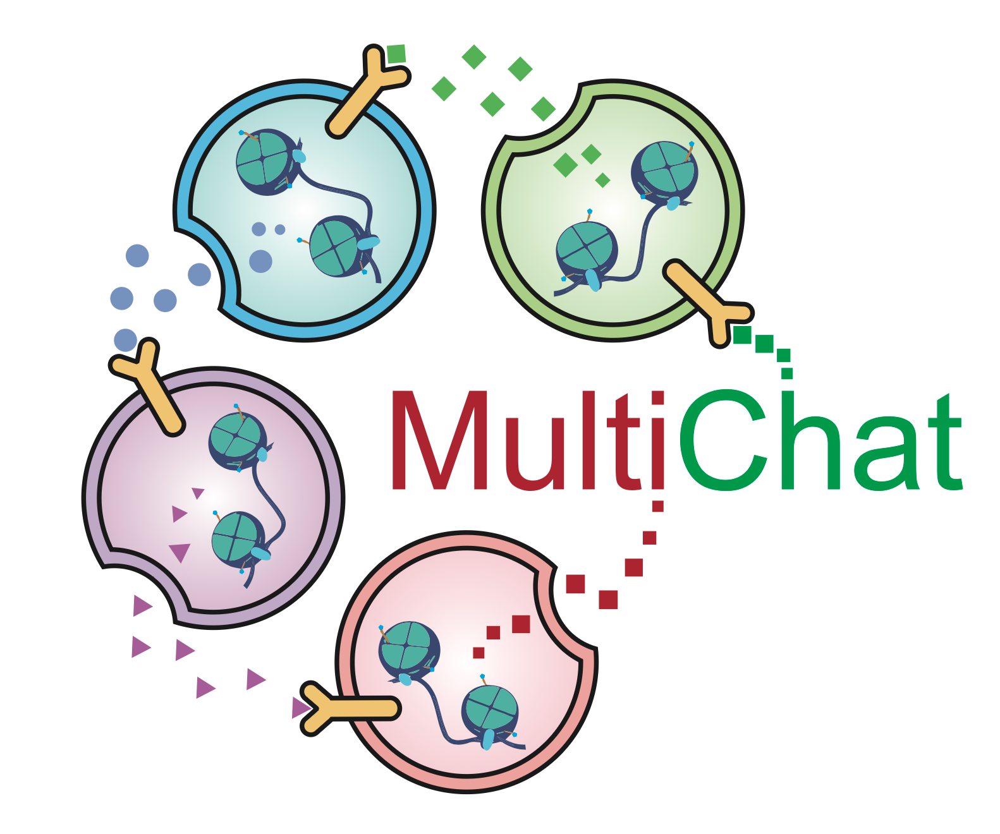

Welcome to MultiChat's documentation!
=====================================

Contents:

- :doc:`Installation <installation>`
- :doc:`Data Preparation: ISSAAC-seq mouse cortex slices <tutorials/data_preprocessing_on_ISSAAC>`
- :doc:`Tutorial 1: Quick Start Guide on simulation data <tutorials/run_MultiChat_on_Simusimp>`
- :doc:`Tutorial 2: ISSAAC-seq mouse cortex slices <tutorials/run_MultiChat_on_ISSAAC>`
- :doc:`Tutorial 3: Human myocardial infarction <tutorials/run_MultiChat_on_Heart>`
- :doc:`Tutorial 4: Spatial multi-omics mouse brain tissue <tutorials/run_MultiChat_on_P22>`
- :doc:`Tutorial 5: Multi-layer Signaling Inference without ATAC-seq data <tutorials/run_MultiChat-wto-chrom_acc>`
- :doc:`Tutorial 6: Ligand-Receptor Interaction Inference without ATAC-seq data <tutorials/run_MultiChat_for_ligand-receptor_identification>`

.. toctree::
   :hidden:
   :maxdepth: 1

   Installation <installation>
   Data Preparation: ISSAAC-seq mouse cortex slices <tutorials/data_preprocessing_on_ISSAAC>
   Tutorial 1: Quick Start Guide on simulation data <tutorials/run_MultiChat_on_Simusimp>
   Tutorial 2: ISSAAC-seq mouse cortex slices <tutorials/run_MultiChat_on_ISSAAC>
   Tutorial 3: Human myocardial infarction <tutorials/run_MultiChat_on_Heart>
   Tutorial 4: Spatial multi-omics mouse brain tissue <tutorials/run_MultiChat_on_P22>
   Tutorial 5: Multi-layer Signaling Inference without ATAC-seq data <tutorials/run_MultiChat-wto-chrom_acc>
   Tutorial 6: Ligand-Receptor Interaction Inference without ATAC-seq data <tutorials/run_MultiChat_for_ligand-receptor_identification>
